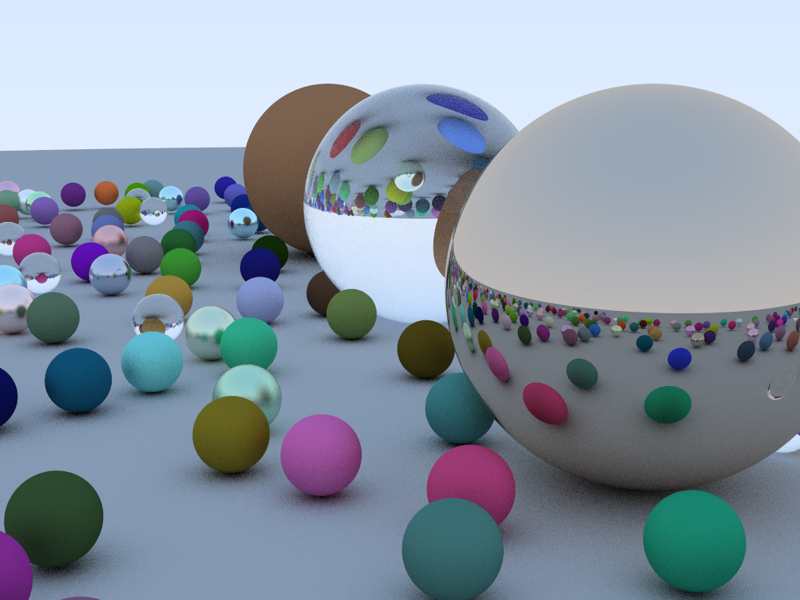
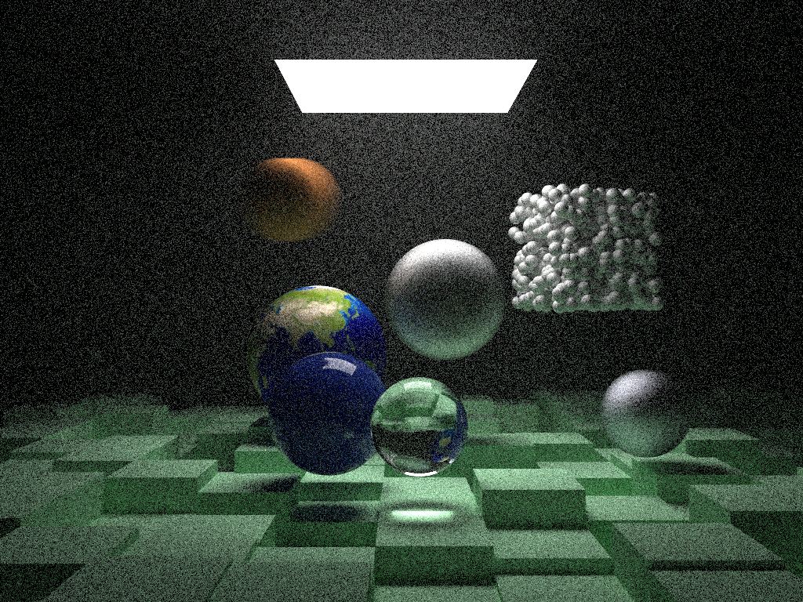

# rtiow
This is my implementation of the excellent [RTIOW ray tracing book](https://raytracing.github.io/) in C, C++, V, Odin, Rust and Go





Check out [RTIOW Readme](rtiow/README.md)

# realist
Simple, naive, C++ ray-tracer

# rayXX
Simple ray-tracer benchmark to compare between C, C++, Vlang and golang.

To run the benchmark :
```
$ make clobber bench BENCH_SIZE=10000
gcc -Wall -Werror -Wextra -g -pipe -std=c99 -O3  -pipe  rayc.c  -lm -o rayc
g++ -Wall -Werror -Wextra -g -pipe -std=c++11 -O3 -I.  -pipe  raycpp.cpp  -lm -o raycpp
cd ray_v ; ../v/v  -o ../rayv_v.c . ; cd ..
gcc -Wall -Werror -Wextra -g -pipe -std=c99 -O3  -pipe rayv_v.c -lm -o rayv -w
GOPATH=`pwd`/ray_go go build -o raygo ray_go/raygo.go
/usr/bin/time ./rayc 10000 10000 rayc.ppm && md5sum rayc.ppm
7.67user 0.20system 0:07.88elapsed 99%CPU (0avgtext+0avgdata 294688maxresident)k
0inputs+585944outputs (0major+764minor)pagefaults 0swaps
0ae8911109ff4a32f471bd704829a44c  rayc.ppm
/usr/bin/time ./rayv 10000 10000 rayv.ppm && md5sum rayv.ppm
11.37user 0.21system 0:11.60elapsed 99%CPU (0avgtext+0avgdata 294684maxresident)k
0inputs+585944outputs (0major+762minor)pagefaults 0swaps
0ae8911109ff4a32f471bd704829a44c  rayv.ppm
/usr/bin/time ./raycpp 10000 10000 raycpp.ppm && md5sum raycpp.ppm
12.09user 0.21system 0:12.32elapsed 99%CPU (0avgtext+0avgdata 296096maxresident)k
0inputs+585944outputs (0major+819minor)pagefaults 0swaps
0ae8911109ff4a32f471bd704829a44c  raycpp.ppm
/usr/bin/time ./raygo 10000 10000 raygo.ppm && md5sum raygo.ppm
15.55user 0.23system 0:15.87elapsed 99%CPU (0avgtext+0avgdata 309420maxresident)k
0inputs+585944outputs (0major+898minor)pagefaults 0swaps
0ae8911109ff4a32f471bd704829a44c  raygo.ppm
```

# Acknowledgements
Many thanks to Aurélie Alvet for her significant Rust optimization
and the Rust community for help with my initial Rust rampup.
Many thanks to Cieric for his C/C++ PCG implementation.
Many thanks to Delyan Angelov for his significant V optimization
done to the V port (both perfs and accuracy).
Many thanks to Amaury for initial rust port.
